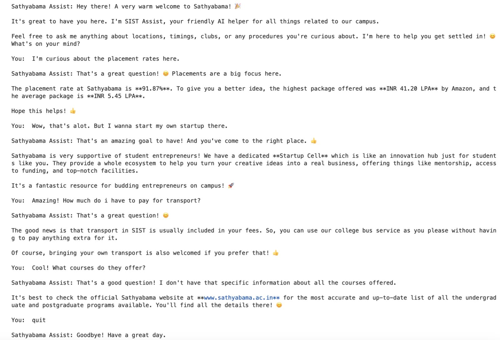

# 🤖 Sathyabama Assist: An AI-Powered Campus Helper

Sathyabama Assist is a conversational AI chatbot designed to provide students with instant, accurate information about the Sathyabama Institute of Science and Technology campus.

---

### ## 🎯 The Problem

Finding specific campus information—like library hours, club details, or administrative procedures—can be a hassle. Information is often scattered across different websites, portals, and notice boards, leading to confusion and wasted time for students.

### ## ✨ The Solution

This chatbot serves as a centralized, 24/7 source of information. By leveraging the power of a Large Language Model (LLM) and strategic **Prompt Engineering**, Sathyabama Assist can understand and answer student queries in a natural, conversational way.

---

### ## 📸 Key Features in Action

**Clean Startup & Ready for Questions:**


**Example Conversation - Getting Quick Answers:**


---

### ## ✅ Core Features

-   **Instant Answers:** Provides immediate responses to questions about campus locations, timings, clubs, and FAQs.
-   **Rule-Based Behavior:** Engineered with a strict set of rules to stay on topic and avoid generating incorrect information.
-   **Natural Conversation:** Uses a conversational model to understand and respond to user queries in a friendly and helpful manner.
-   **Secure API Handling:** API keys are handled securely and are not stored in the notebook, ensuring project safety.

---

### ## 🛠️ Tech Stack & Skills Demonstrated

-   **Backend:** Python
-   **AI Model:** Google Gemini (`models/gemini-pro-latest`)
-   **Core Technique:** Prompt Engineering (designing a detailed system prompt to control the AI's persona, rules, and knowledge base).
-   **Environment:** Jupyter Notebook
-   **API Integration:** Interacting with the Google Generative AI API.

---

### ## 🚀 How to Run This Project

1.  **Clone the Repository:**
    ```bash
    git clone [https://github.com/YOUR_USERNAME/YOUR_REPOSITORY_NAME.git](https://github.com/YOUR_USERNAME/YOUR_REPOSITORY_NAME.git)
    ```
2.  **Navigate to the Project Directory:**
    ```bash
    cd SIST-assist
    ```
3.  **Install Dependencies:**
    ```bash
    pip install -r requirements.txt
    ```
4.  **Launch the Notebook:**
    ```bash
    jupyter notebook bot_main.ipynb
    ```
5.  Run the first cell and, when prompted, securely enter your Google Gemini API key to start the bot.